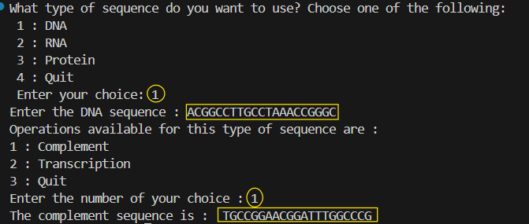
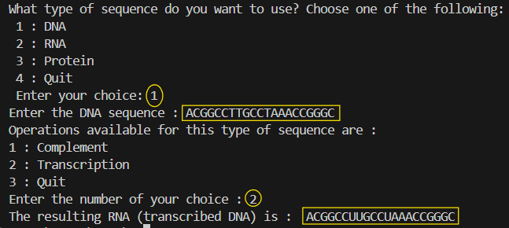
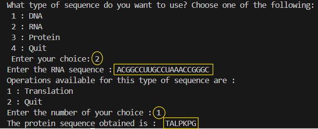
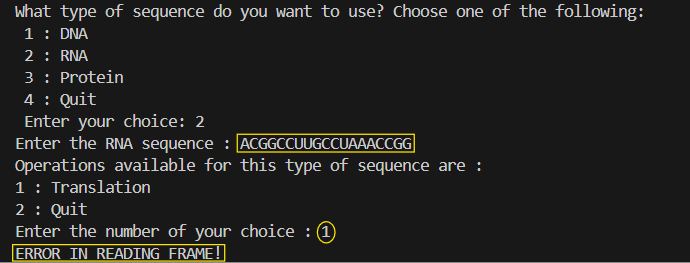
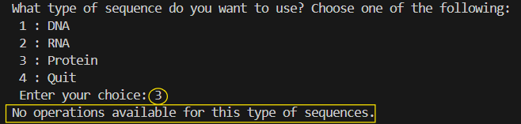

# SequenceTools-Biopython 

A menu-based program for **DNA / RNA / Protein** operations written in **Python** using Biopython library.  
Originally built for my **Bioinformatics coursework** and later **refined and polished** for clarity.

> Purpose: show how to automate basic sequence tasks with clean, readable code that anyone can run from a terminal.

---

##  Core principles
The script reads your sequence as text.

- **Complements** a DNA sequence: A ↔ T, C ↔ G  
- **Transcribes** DNA → RNA: T → U
- **Translates** RNA → Protein: 3 RNA letters (a codon) → 1 amino acid  
- **Inserts a random substitution** in a protein (single amino-acid mutation)

The script uses Bio.Seq objects to represent and manipulate sequences.

Calls .complement(), .transcribe(), .translate() directly from Biopython.

---

##  How to run

**Requirements:** 

- Python 3.8+
- Biopython. Install with this line:

```bash
pip install biopython
```
**To run the file:** 

```bash
python seq_cli_purepython.py
```
---
##  Concrete examples (input → output)

### 1) Complement (DNA → cDNA)

The user enters a DNA sequence, chooses 1: Complement.

Input (DNA): ACGGCCTTGCCTAAACCGGGC

Output (Complement): TGCCGGAACGGATTTGGCCCG



### 2) Transcribe (DNA → RNA)

Choose 2: Transcribe.

Input (DNA): ACGGCCTTGCCTAAACCGGGC

Output (RNA): ACGGCCUUGCCUAAACCGGGC



### 3) Translate (RNA → Protein)

Choose 3: Translate.

Input (RNA): ACGGCCUUGCCUAAACCGGGC

Output (Protein): TALPKPG



In case the number of nucelotides is not a multiple of 3, an error message will be displayed (see below)



### 4) Protein operations (not developed yet in this program)

As operations on protein sequences are not included in this program, the following messsage will be displayed (check below)



More operations on protein/amino acids sequences are to be found in future repositories.


